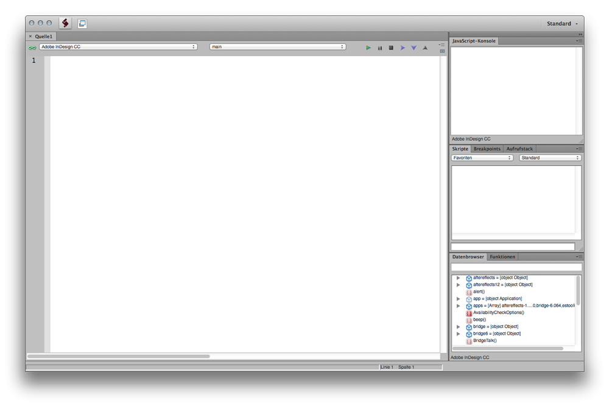
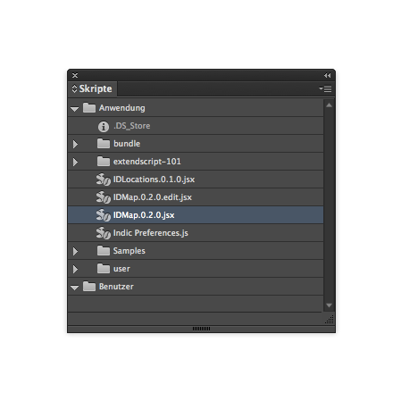
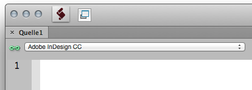
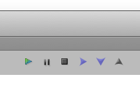

extendscript-101
================

Examples for learning the basics of Adobe ExtendScript @FH-Potsdam with a focus on InDesign and graphics.  

For more extendscript examples see [github.com/fabiantheblind/extendscript](https://github.com/fabiantheblind/extendscript)  

##prerequisites  

1. Learn some javascript basics e.g. [here @ codecademy](http://www.codecademy.com/tracks/javascript)  
2. Install InDesign via [creative cloud download](https://creative.adobe.com/products/indesign)  
3. Choose your editor. Adobe has a own editor called the ExtendScript Toolkit (ESTK). You can download it [here](https://creative.adobe.com/products/estk) or install it via the creative cloud application. On CS 3 till CS 6 it normally got installed right away. You can use a different editor if you like. This document assumes you use the ESTK.   
  
4. Check ot the [Adobe Scripting Center](http://www.adobe.com/devnet/scripting.html) for more Tutorials and examples. Download the [InDesign Scripting SDK](http://www.adobe.com/devnet/indesign/sdk.html) for your operating system.  
5. Open or unpack the SDK. take a lock at the folder: indesign > scriptingguide > scripts > JavaScript. There you will find a lot of examples provided by Adobe.  
5. Find your "Scripts Panel" within InDesign and the corresponding folder on your harddrive. See [this help topic](http://helpx.adobe.com/indesign/using/scripting.html) for further information.  
6. Move the exendscript-101 folder and the whole SDK to your "Scripts Panel" folder.  
6. Create a file called "hello-world.jsx" in the "Scripts Panel" folder and add the following code to it `var doc = app.documents.add(); doc.pages[0].textFrames.add({geometricBounds:[0,0,100,100],contents:"hello InDesign"});`  
7. In InDesign. Go to Menu > Windows > Utilities > Scripts (Actually we are in Germany. So localized it is: Menü > Fenster > Dienstprogramme > Skripte ). It should look something like this. 
  
7. Execute the script from within InDesign. You should get a new document with a text frame and some text in it.  
8. Paste the same code into the ESTK.
9. select the target application (InDesign) from the pulldown menu on the top.  
  
Don't safe it, just hit the ► (play/run) button on the top right.  
  
You should get the same result as before.

Congratulations. You have your setup right. So lets move on to some more advanced topics.  

##01 polygons-rectangles-ovals.jsx

##02 graphiclines.jsx

##03 text.jsx

##04 swatches.jsx  

##05 selection-and-groups.jsx

Copyright (c)  2014 Fabian "fabiantheblind" Morón Zirfas & FH-Potsdam  
Permission is hereby granted, free of charge, to any person obtaining a copy of this software and associated documentation files (the "Software"), to deal in the Software  without restriction, including without limitation the rights to use, copy, modify, merge, publish, distribute, sublicense, and/or sell copies of the Software, and to  permit persons to whom the Software is furnished to do so, subject to the following conditions:  
The above copyright notice and this permission notice shall be included in all copies or substantial portions of the Software.  
THE SOFTWARE IS PROVIDED "AS IS", WITHOUT WARRANTY OF ANY KIND, EXPRESS OR IMPLIED, INCLUDING BUT NOT LIMITED TO THE WARRANTIES OF MERCHANTABILITY, FITNESS FOR A  PARTICULAR PURPOSE AND NONINFRINGEMENT. IN NO EVENT SHALL THE AUTHORS OR COPYRIGHT HOLDERS BE LIABLE FOR ANY CLAIM, DAMAGES OR OTHER LIABILITY, WHETHER IN AN ACTION OF  CONTRACT, TORT OR OTHERWISE, ARISING FROM, OUT OF OR IN CONNECTION WITH THE SOFTWARE OR THE USE OR OTHER DEALINGS IN THE SOFTWARE.  

see also http://www.opensource.org/licenses/mit-license.php

